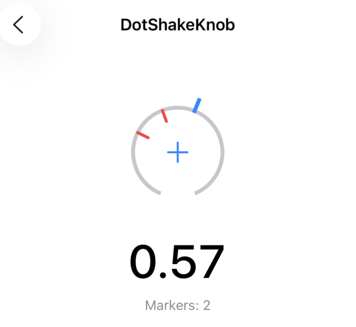

# DotShakeKnob

[](https://swift.org)
[](https://developer.apple.com/ios/)
[](https://swift.org/package-manager/)
[](LICENSE)


<p align="center">
  
</p>


A feature-rich rotatable knob/dial control for iOS with visual markers, haptic feedback, snap behavior, and persistence support.

### Used By

<a href="https://apps.apple.com/au/app/dotshake/id6747894313">
  
</a>

## Features

- Rotatable dial control with customizable appearance
- Drawing or image-based track and pointer styles
- Haptic feedback (step, boundary, or both)
- Visual markers with snap-to-marker behavior
- Center tap to add/remove markers
- Persistent storage for markers via UserDefaults
- Hard stop at boundaries (prevents jumping across gap)

## Showcase

Apps using DotShakeToolbar in production:

| App | Description |
|-----|-------------|
| [DotShake](https://apps.apple.com/au/app/dotshake/id6747894313) | A delightful drawing app for iOS |

> Using DotShakeKnob in your app? Feel free to open a PR to add it here!

## Installation

### Swift Package Manager

Add to your `Package.swift`:

```swift
dependencies: [
    .package(url: "https://github.com/Humble7/DotShakeUIKit", from: "0.0.2")
]

targets: [
    .target(
        dependencies: [
            .product(name: "DotShakeKnob", package: "DotShakeUIKit")
        ]
    )
]
```

## File Structure

```
DotShakeKnob/
├── Knob.swift                  # Base rotatable knob control
├── MarkedKnob.swift            # Extended knob with markers
├── RotationGestureRecognizer.swift  # Custom rotation gesture
├── MarkerStorage.swift         # Actor for persistent storage
└── MarkerBinding.swift         # Auto-binding for persistence
```

## Quick Start

### Basic Knob

```swift
import DotShakeKnob

let knob = Knob()
knob.minimumValue = 0
knob.maximumValue = 100
knob.isContinuous = true

// Listen for value changes
knob.addTarget(self, action: #selector(valueChanged), for: .valueChanged)
knob.addTarget(self, action: #selector(editingEnded), for: .editingDidEnd)

// Set value programmatically
knob.setValue(50, animated: true)
```

### MarkedKnob with Markers

```swift
let markedKnob = MarkedKnob()

// Configure appearance
markedKnob.trackStyle = .drawing(lineWidth: 4, color: .systemGray3)
markedKnob.pointerStyle = .drawing(length: 14, lineWidth: 4, color: .systemBlue)

// Configure haptics
markedKnob.hapticStyle = .stepAndBoundary
markedKnob.stepInterval = 0.1
markedKnob.stepFeedbackIntensity = 0.5
markedKnob.boundaryFeedbackIntensity = 0.8

// Configure markers
markedKnob.markerStyle = MarkerStyle(
    color: .systemRed,
    length: 12,
    lineWidth: 3,
    tolerance: 0.05
)

markedKnob.snapBehavior = SnapBehavior(
    enabled: true,
    threshold: 0.08,
    animated: true
)

// Add markers
markedKnob.addMarkerAtCurrentPosition()
markedKnob.addMarker(at: 0.5, color: .systemGreen)

// Listen for marker changes
markedKnob.onMarkersChanged = { markers in
    print("Markers count: \(markers.count)")
}
```

### Auto-Persistence

```swift
// Bind to storage (auto-saves and loads markers)
let binding = markedKnob.bindStorage(key: "myKnob")

// Later: unbind or clear
binding.unbind()
await binding.clear()
```

## API Reference

### Knob

The base rotatable dial control.

#### Properties

| Property | Type | Default | Description |
|----------|------|---------|-------------|
| `value` | `CGFloat` | `0` | Current value (read-only, use `setValue()`) |
| `minimumValue` | `CGFloat` | `0` | Minimum value |
| `maximumValue` | `CGFloat` | `1` | Maximum value |
| `startAngle` | `CGFloat` | `-π * 11/8` | Start angle in radians |
| `endAngle` | `CGFloat` | `π * 3/8` | End angle in radians |
| `isContinuous` | `Bool` | `true` | Send `.valueChanged` continuously during gesture |
| `trackStyle` | `TrackStyle` | `.drawing()` | Track appearance |
| `pointerStyle` | `PointerStyle` | `.drawing()` | Pointer appearance |
| `hapticStyle` | `HapticFeedbackStyle` | `.stepAndBoundary` | Haptic feedback mode |
| `stepInterval` | `CGFloat` | `0.1` | Interval for step feedback |
| `stepFeedbackIntensity` | `CGFloat` | `0.4` | Step feedback intensity (0-1) |
| `boundaryFeedbackIntensity` | `CGFloat` | `0.7` | Boundary feedback intensity (0-1) |

#### Methods

| Method | Description |
|--------|-------------|
| `setValue(_:animated:)` | Set the knob value |
| `angle(for:)` | Get angle for a specific value |

#### Computed Properties

| Property | Type | Description |
|----------|------|-------------|
| `trackRadius` | `CGFloat` | Calculated track radius |
| `trackCenter` | `CGPoint` | Center point of the track |

#### Events

| Event | Description |
|-------|-------------|
| `.valueChanged` | Fired when value changes |
| `.editingDidEnd` | Fired when gesture ends |

### MarkedKnob

Extended knob with visual markers and snap behavior.

#### Properties

| Property | Type | Default | Description |
|----------|------|---------|-------------|
| `knob` | `Knob` | - | The underlying Knob instance (read-only) |
| `markers` | `[KnobMarker]` | `[]` | Array of markers |
| `markerStyle` | `MarkerStyle` | `.default` | Default style for new markers |
| `snapBehavior` | `SnapBehavior` | `.default` | Snap-to-marker configuration |
| `symbolStyle` | `SymbolStyle` | `.default` | Center symbol (+/-) style |
| `onMarkersChanged` | `(([KnobMarker]) -> Void)?` | `nil` | Callback when markers change |

#### Proxied Properties from Knob

All these properties are proxied to the underlying `Knob`:

- `value`, `minimumValue`, `maximumValue`
- `trackStyle`, `pointerStyle`
- `hapticStyle`, `stepInterval`, `stepFeedbackIntensity`, `boundaryFeedbackIntensity`

#### Methods

| Method | Description |
|--------|-------------|
| `setValue(_:animated:)` | Set the knob value |
| `addMarkerAtCurrentPosition()` | Add marker at current value |
| `addMarker(at:color:length:lineWidth:)` | Add marker at specific value |
| `removeMarker(at:)` | Remove marker by index |
| `removeAllMarkers()` | Remove all markers |
| `bindStorage(key:storage:)` | Bind to persistent storage |

#### Interaction

- **Rotate**: Drag to change value
- **Tap center (+)**: Add marker at current position
- **Tap center (-)**: Remove marker at current position

### TrackStyle

Enum for track appearance.

```swift
public enum TrackStyle {
    case drawing(lineWidth: CGFloat = 2, color: UIColor = .systemBlue)
    case image(UIImage, contentMode: UIView.ContentMode = .scaleAspectFit)
}
```

### PointerStyle

Enum for pointer appearance.

```swift
public enum PointerStyle {
    case drawing(length: CGFloat = 6, lineWidth: CGFloat = 2, color: UIColor = .systemBlue)
    case image(UIImage, size: CGSize? = nil)
}
```

### HapticFeedbackStyle

Enum for haptic feedback modes.

| Value | Description |
|-------|-------------|
| `.none` | No haptic feedback |
| `.step` | Feedback at step intervals |
| `.boundary` | Feedback at min/max boundaries |
| `.stepAndBoundary` | Both step and boundary feedback |

### MarkerStyle

Configuration for marker appearance.

| Property | Type | Default | Description |
|----------|------|---------|-------------|
| `color` | `UIColor` | `.systemRed` | Marker color |
| `length` | `CGFloat` | `15` | Marker length |
| `lineWidth` | `CGFloat` | `2` | Marker line width |
| `tolerance` | `CGFloat` | `0.02` | Distance to detect "at marker" |

```swift
// Default preset
MarkerStyle.default

// Custom
MarkerStyle(color: .systemGreen, length: 12, lineWidth: 3, tolerance: 0.05)
```

### SnapBehavior

Configuration for snap-to-marker behavior.

| Property | Type | Default | Description |
|----------|------|---------|-------------|
| `enabled` | `Bool` | `true` | Enable snapping |
| `threshold` | `CGFloat` | `0.05` | Snap distance threshold |
| `animated` | `Bool` | `true` | Animate snap |

```swift
// Presets
SnapBehavior.default   // enabled, threshold: 0.05, animated
SnapBehavior.disabled  // disabled

// Custom
SnapBehavior(enabled: true, threshold: 0.08, animated: true)
```

### SymbolStyle

Configuration for center symbol (+/-) appearance.

| Property | Type | Default | Description |
|----------|------|---------|-------------|
| `color` | `UIColor` | `.systemBlue` | Color when no marker nearby |
| `activeColor` | `UIColor` | `.systemRed` | Color when at marker |
| `size` | `CGFloat` | `20` | Symbol size |
| `lineWidth` | `CGFloat` | `2` | Symbol line width |
| `tapRadius` | `CGFloat` | `22` | Tap detection radius |

### KnobMarker

Data structure for a marker (Codable for persistence).

| Property | Type | Description |
|----------|------|-------------|
| `value` | `CGFloat` | Position value |
| `color` | `UIColor` | Marker color |
| `length` | `CGFloat` | Marker length |
| `lineWidth` | `CGFloat` | Marker line width |

### MarkerStorage

Thread-safe actor for persisting markers to UserDefaults.

```swift
// Singleton
MarkerStorage.shared

// Custom UserDefaults
MarkerStorage(defaults: myDefaults)
```

#### Methods

| Method | Description |
|--------|-------------|
| `save(_:forKey:)` | Save markers to key |
| `load(forKey:)` | Load markers from key |
| `clear(forKey:)` | Clear markers for key |
| `save(_:)` | Save to default key |
| `load()` | Load from default key |
| `clear()` | Clear default key |

### MarkerBinding

Auto-binding class for persistent marker storage.

```swift
// Create binding
let binding = MarkerBinding(knob: markedKnob, storage: .shared, key: "myKey")
binding.bind()

// Or use convenience method
let binding = markedKnob.bindStorage(key: "myKey")

// Unbind
binding.unbind()

// Clear stored markers
await binding.clear()
```

## Usage Examples

### Custom Image Pointer

```swift
let knob = Knob()

// Use custom image for pointer
if let pointerImage = UIImage(named: "custom_pointer") {
    knob.pointerStyle = .image(pointerImage, size: CGSize(width: 40, height: 40))
}

// Use custom image for track
if let trackImage = UIImage(named: "custom_track") {
    knob.trackStyle = .image(trackImage, contentMode: .scaleAspectFit)
}
```

### Value Range 0-100

```swift
let knob = Knob()
knob.minimumValue = 0
knob.maximumValue = 100
knob.stepInterval = 10  // Haptic every 10 units

knob.addTarget(self, action: #selector(valueChanged), for: .valueChanged)

@objc func valueChanged(_ sender: Knob) {
    let percentage = Int(sender.value)
    print("Value: \(percentage)%")
}
```

### Preset Markers

```swift
let markedKnob = MarkedKnob()

// Add preset markers
let presets: [CGFloat] = [0, 0.25, 0.5, 0.75, 1.0]
for value in presets {
    markedKnob.addMarker(at: value, color: .systemBlue)
}

// Disable manual marker creation (tap to add/remove)
// by setting tapRadius to 0
markedKnob.symbolStyle = SymbolStyle(
    color: .clear,
    activeColor: .clear,
    size: 0,
    lineWidth: 0,
    tapRadius: 0  // Disable tap interaction
)
```

### Syncing with Slider

```swift
class ViewController: UIViewController {
    let knob = MarkedKnob()
    let slider = UISlider()

    override func viewDidLoad() {
        super.viewDidLoad()

        knob.addTarget(self, action: #selector(knobChanged), for: .valueChanged)
        slider.addTarget(self, action: #selector(sliderChanged), for: .valueChanged)
    }

    @objc func knobChanged(_ sender: MarkedKnob) {
        slider.value = Float(sender.value)
    }

    @objc func sliderChanged(_ sender: UISlider) {
        knob.setValue(CGFloat(sender.value), animated: false)
    }
}
```

## Architecture

```
┌─────────────────────────────────────────────────────┐
│                    MarkedKnob                       │
│  ┌───────────────────────────────────────────────┐  │
│  │                    Knob                       │  │
│  │  ┌─────────────────────────────────────────┐  │  │
│  │  │            KnobRenderer                 │  │  │
│  │  │  - trackLayer (CALayer)                 │  │  │
│  │  │  - pointerLayer (CALayer)               │  │  │
│  │  └─────────────────────────────────────────┘  │  │
│  │  ┌─────────────────────────────────────────┐  │  │
│  │  │      RotationGestureRecognizer          │  │  │
│  │  └─────────────────────────────────────────┘  │  │
│  └───────────────────────────────────────────────┘  │
│  ┌───────────────────────────────────────────────┐  │
│  │            Markers Container                  │  │
│  │  - markerLayers (CAShapeLayer[])              │  │
│  └───────────────────────────────────────────────┘  │
│  ┌───────────────────────────────────────────────┐  │
│  │           Center Symbol (+/-)                 │  │
│  │  - Drawn in draw(_ rect:)                     │  │
│  └───────────────────────────────────────────────┘  │
└─────────────────────────────────────────────────────┘
         │
         │ onMarkersChanged
         ▼
┌─────────────────────────────────────────────────────┐
│                 MarkerBinding                       │
│  - Auto-save on change                              │
│  - Auto-load on bind                                │
└─────────────────────────────────────────────────────┘
         │
         │ async save/load
         ▼
┌─────────────────────────────────────────────────────┐
│                 MarkerStorage                       │
│  - Actor (thread-safe)                              │
│  - UserDefaults persistence                         │
│  - JSON encoding/decoding                           │
└─────────────────────────────────────────────────────┘
```

## Thread Safety

- `MarkerStorage` is implemented as an `Actor` for thread-safe persistence
- `MarkerBinding` is `@MainActor` isolated for UI safety
- `MarkerStyle`, `SnapBehavior`, `SymbolStyle` conform to `Sendable`
- `KnobMarker` is `Codable` and `@unchecked Sendable`

## Requirements

- iOS 17.0+
- Swift 6.1+

## License

MIT License
