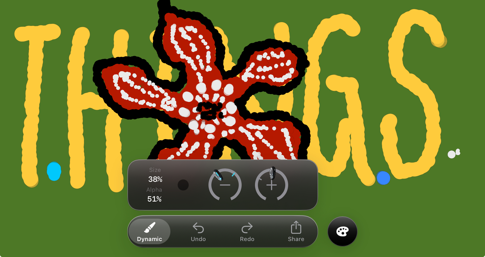

# DotShakeToolbar

[](https://swift.org)
[](https://developer.apple.com/ios/)
[](https://swift.org/package-manager/)
[](LICENSE)

<p align="center">
  
</p>


Glass style custom toolbar built with UIKit and Auto Layout.

Supports side floating buttons, bottom accessory views, and space-adaptive layouts.

### Used By

<a href="https://apps.apple.com/au/app/dotshake/id6747894313">
  
</a>

## UI Overview

<details>
  <summary><strong>Plain Tool Bar</strong></summary>
  <br/>
  
</details>

<details>
  <summary><strong>Tool Bar with Side Button & Accessory View</strong></summary>
  <br/>
  
</details>

<details>
  <summary><strong>Tool Bar with Dual Accessory Views</strong></summary>
  <br/>
  
</details>

<details>
  <summary><strong>Tool Bar with More Action Menu</strong></summary>
  <br/>
  
</details>

<details>
  <summary><strong>Adaptive Toolbar Layout for Split View</strong></summary>
  <br/>
  
</details>

## Showcase

Apps using DotShakeToolbar in production:

| App | Description |
|-----|-------------|
| [DotShake](https://apps.apple.com/au/app/dotshake/id6747894313) | A delightful drawing app for iOS |

> Using DotShakeToolbar in your app? Feel free to open a PR to add it here!

## Installation

### Swift Package Manager

In Xcode:
1. File → Add Package Dependencies...
2. Enter the repository URL: `https://github.com/Humble7/DotShakeUIKit`
3. Select version rules

Or add to your `Package.swift`:

```swift
dependencies: [
    .package(url: "https://github.com/Humble7/DotShakeUIKit", from: "0.0.2")
]

targets: [
    .target(
        dependencies: [
            .product(name: "DotShakeToolbar", package: "DotShakeUIKit")
        ],
    )
]
```

## Features

### 1. Glass Toolbar
- Frosted glass background effect (`UIVisualEffectView` with `systemUltraThinMaterial`)
- Dynamic gloss gradient layer
- Selection indicator with spring animation

### 2. Side Button (Floating Side Button)
- **Independent UI style from the toolbar**
- Multiple preset styles: glass, primary, secondary, success, warning, danger
- Custom icons and colors
- Tap animation and haptic feedback
- **Swipe gesture support** (up/down/left/right)
- **Space priority** (essential/primary/secondary)

### 3. Accessory View (Bottom Accessory View)
- Positioned above the toolbar
- Automatically gets glass background
- Uses `GlassAccessoryProvider` protocol for unified lifecycle management
- Built-in: `HorizontalListAccessoryView` for scrollable lists

### 4. Space-Adaptive Layout
- **Based on actual width** rather than Size Class for layout
- **5-level space tiers**: spacious/regular/compact/tight/minimal
- **Item priority**: essential (always visible)/primary/secondary/overflow
- **Progressive compression**: spacing→title→icon→hide
- **Overflow menu**: hidden items go into a more menu
- **Perfect iPad split-screen support**

### 5. Other Features
- Dark mode support
- Touch passthrough for overlay usage

## File Structure

```
DotShakeToolbar/
├── Public/                             # Public API
│   ├── GlassToolbarController.swift    # Main controller
│   ├── GlassToolbarItem.swift          # Item configuration
│   ├── GlassSideButtonConfig.swift     # Side button configuration
│   ├── GlassAccessoryProvider.swift    # Accessory provider protocol
│   ├── ToolbarConfiguration.swift      # Appearance & state configuration
│   └── HorizontalListAccessoryView.swift # Built-in list accessory
│
├── Internal/                           # Internal implementation
│   ├── View/
│   │   ├── GlassToolbarView.swift      # Main toolbar view
│   │   └── GlassFloatingButton.swift   # Floating button view
│   ├── Managers/
│   │   ├── AccessoryViewManager.swift
│   │   ├── SideButtonManager.swift
│   │   ├── ToolbarItemsManager.swift
│   │   ├── ToolbarConstraintsManager.swift
│   │   └── OverflowMenuHandler.swift
│   ├── Coordinators/
│   │   └── ToolbarStateCoordinator.swift
│   ├── Layout/
│   │   ├── ToolbarLayoutSystem.swift   # Layout coordinator & types
│   │   ├── UltraMinimalModeHandler.swift
│   │   └── ToolbarPosition.swift
│   └── Animation/
│       └── ToolbarAnimator.swift       # Interruptible animations
│
└── Accessories/                        # Built-in accessory components
    └── GlassAccessoryComponents.swift  # Glass background views
```

## Code Architecture

The Controller follows the **Single Responsibility Principle**, splitting complex logic into specialized manager/handler classes:

### Manager Responsibilities

| Manager/Handler | Responsibility | Delegate Protocol |
|----------------|----------------|-------------------|
| `ToolbarItemsManager` | Items management: items array, selection state, current config convenience access, cleanup | `ToolbarItemsManagerDelegate` |
| `SideButtonManager` | Side Button full lifecycle: creation, constraints, show/hide animation, layout mode adaptation | `SideButtonManagerDelegate` |
| `AccessoryViewManager` | Accessory View management: primary/secondary containers, Provider lifecycle callbacks, delayed display, animation | `AccessoryViewManagerDelegate` |
| `ToolbarStateCoordinator` | State machine logic: each item's Accessory expanded state, tap cycle logic, state transition calculation | `ToolbarStateCoordinatorDelegate` |
| `UltraMinimalModeHandler` | Ultra minimal mode management: state switching, layout calculation, finding most important item, mode recovery | `UltraMinimalModeHandlerDelegate` |
| `ToolbarConstraintsManager` | Constraints management: create/hold constraint references, update width/offset/bottom constraints | `ToolbarConstraintsManagerDelegate` |
| `OverflowMenuHandler` | Overflow menu: menu item building, ActionSheet display, iPad popover adaptation | `OverflowMenuHandlerDelegate` |

### Unified Layout Application Interface

The `ToolbarLayoutApplication` struct unifies `ToolbarLayoutResult` and `UltraMinimalLayoutResult` layout application:

```swift
// Both layout results can be converted to unified application params
let params = layoutResult.toApplicationParams()
let ultraParams = ultraMinimalResult.toApplicationParams()

// Controller applies layout through unified method
private func performLayoutApplication(_ params: ToolbarLayoutApplication, animated: Bool)
```

This avoids duplicate code in the Controller. UltraMinimalModeHandler calls the same layout application logic through its delegate.

## Quick Start

### Basic Usage

```swift
import DotShakeToolbar

class MyViewController: UIViewController {

    override func viewDidLoad() {
        super.viewDidLoad()

        // 1. Create toolbar controller
        let toolbarController = GlassToolbarController()

        // 2. Configure toolbar items
        let items: [GlassToolbarItem] = [
            GlassToolbarItem(
                title: "Home",
                icon: UIImage(systemName: "house"),
                selectedIcon: UIImage(systemName: "house.fill"),
                action: { print("Home tapped") }
            ),
            GlassToolbarItem(
                title: "Settings",
                icon: UIImage(systemName: "gearshape"),
                selectedIcon: UIImage(systemName: "gearshape.fill"),
                action: { print("Settings tapped") }
            )
        ]

        // 3. Set toolbar items
        toolbarController.setItems(items)

        // 4. Add to view (as overlay - touches pass through to content below)
        addChild(toolbarController)
        toolbarController.view.frame = view.bounds
        view.addSubview(toolbarController.view)
        toolbarController.didMove(toParent: self)
    }
}
```

> **Note**: The toolbar controller uses a passthrough view - touches on empty areas pass through to views below, so it can be safely used as an overlay without blocking content interaction.

### Adding Side Floating Button

Side Button supports two modes:

#### 1. Associated with Specific Item (Recommended)

```swift
// Set associated sideButton for specific items
let items: [GlassToolbarItem] = [
    GlassToolbarItem(
        title: "Home",
        icon: UIImage(systemName: "house"),
        sideButton: .addButton { print("Add") }  // Home shows add button
    ),
    GlassToolbarItem(
        title: "Favorites",
        icon: UIImage(systemName: "heart"),
        sideButton: .styled(.danger, icon: UIImage(systemName: "trash")) {
            print("Delete")  // Favorites shows delete button
        }
    ),
    GlassToolbarItem(
        title: "Settings",
        icon: UIImage(systemName: "gearshape")
        // Settings doesn't show side button
    )
]

controller.setItems(items)
```

#### 2. Global Side Button

```swift
// Set global sideButton (shown when item has no association)
controller.globalSideButton = .addButton { print("Add") }
```

**Priority:** Item-associated sideButton > Global globalSideButton

#### 3. Dynamic Update Side Button Appearance

You can dynamically update the side button's icon, background color, and tint color at runtime:

```swift
// Update icon only
controller.updateSideButtonAppearance(
    icon: UIImage(systemName: "checkmark")
)

// Update background color and tint color
controller.updateSideButtonAppearance(
    backgroundColor: .systemGreen,
    tintColor: .white
)

// Update all properties with animation
controller.updateSideButtonAppearance(
    icon: UIImage(systemName: "pause.fill"),
    backgroundColor: .systemGreen,
    tintColor: .white,
    animated: true
)

// Update without animation
controller.updateSideButtonAppearance(
    icon: UIImage(systemName: "stop.fill"),
    animated: false
)
```

**Example: Play/Pause Toggle**

```swift
var isPlaying = false

// Initial setup
sideButton: .styled(.primary, icon: UIImage(systemName: "play.fill"), action: { [weak self] in
    guard let self = self else { return }
    self.isPlaying.toggle()

    // Dynamically update appearance
    self.toolbarController.updateSideButtonAppearance(
        icon: UIImage(systemName: self.isPlaying ? "pause.fill" : "play.fill"),
        backgroundColor: self.isPlaying ? .systemGreen : .systemBlue
    )
})
```

**Notes:**
- Pass `nil` for any parameter to keep its current value
- `backgroundColor` update only works for non-glass buttons (`.glass` style uses blur effect)
- Animation duration is 0.25 seconds

#### 4. Dynamic Update Toolbar Item

You can dynamically update a toolbar item's icon and title using `updateItem(at:transform:)`:

```swift
// Update icon and title when brush is selected
toolbarController.updateItem(at: 0) { item in
    var updatedItem = item
    updatedItem.icon = UIImage(systemName: "pencil.tip")
    updatedItem.selectedIcon = UIImage(systemName: "pencil.tip")
    updatedItem.title = "Monoline"
    return updatedItem
}
```

**Notes:**
- Only updates the specified item without recreating all items
- Does not trigger accessory view animation
- Useful for syncing item appearance with accessory view selection

#### 5. Swipe Gesture Support

Side Button supports swipe gestures in four directions (up/down/left/right):

```swift
// Create side button with swipe gesture
let sideButton = GlassSideButtonConfig(
    icon: UIImage(systemName: "paintpalette.fill"),
    backgroundColor: .systemBlue,
    tintColor: .white,
    priority: .essential,
    gestures: SideButtonGestureConfig(
        onTap: {
            print("Tapped - show color picker")
        },
        onSwipe: { direction in
            switch direction {
            case .up: print("Swipe up - increase size")
            case .down: print("Swipe down - decrease size")
            case .left: print("Swipe left")
            case .right: print("Swipe right")
            }
        },
        enabledDirections: [.up, .down],  // Only enable up/down
        swipeThreshold: 30,               // Distance threshold (default 30pt)
        swipeVelocityThreshold: 200       // Velocity threshold (default 200pt/s)
    )
)
```

**Using convenience initializer:**

```swift
// Quick creation with swipe support
sideButton: .styled(
    .primary,
    icon: UIImage(systemName: "paintbrush"),
    onTap: { print("Tap") },
    onSwipe: { direction in print("Swipe: \(direction)") },
    enabledDirections: [.up, .down, .left, .right]
)
```

**SwipeDirection:**

| Direction | Description |
|-----------|-------------|
| `.up` | Swipe upward |
| `.down` | Swipe downward |
| `.left` | Swipe left |
| `.right` | Swipe right |

**Visual Feedback:**
- Start swiping: slight scale down (0.95)
- During swipe: follows finger with limited offset (max 8pt)
- Trigger threshold: haptic feedback + direction bounce animation
- Release: spring animation back to position

### Adding Bottom Accessory View

Accessory View uses the `GlassAccessoryProvider` protocol, supporting lifecycle management (willAppear/didAppear/willDisappear/didDisappear).

#### 1. Using HorizontalListAccessoryView

```swift
let brushList = HorizontalListAccessoryView()
brushList.configure(
    title: "Brushes",
    items: [
        .init(icon: UIImage(systemName: "pencil.tip"), title: "Fine", tintColor: .label),
        .init(icon: UIImage(systemName: "paintbrush"), title: "Medium", tintColor: .label),
        .init(icon: UIImage(systemName: "paintbrush.pointed"), title: "Thick", tintColor: .label)
    ],
    selectedIndex: 0,
    configuration: .init(
        showsSelection: true,      // Show selection ring
        showsCount: true,          // Show item count
        selectionColor: .label,    // Icon/label color when selected
        borderColor: .systemBlue   // Selection ring border color (optional)
    )
)

brushList.onItemTap = { index in
    print("Selected brush: \(index)")
}

// Attach to item
GlassToolbarItem(
    title: "Brush",
    icon: UIImage(systemName: "paintbrush"),
    accessoryProvider: brushList
)
```

#### 2. Custom Accessory Provider

Wrap any UIView as an accessory:

```swift
// Simple wrapper
let myView = UIView()
let accessory = myView.asAccessoryProvider(height: 60, width: nil)

// Or use SimpleAccessoryWrapper for cleanup support
let wrapper = SimpleAccessoryWrapper(
    view: myView,
    preferredHeight: 60,
    preferredWidth: nil,
    minimumWidth: 200,
    cleanup: { /* cleanup code */ }
)
```

#### 3. Full Custom Provider

```swift
class MyAccessoryProvider: GlassAccessoryProvider {
    let accessoryView: UIView = MyCustomView()
    let preferredHeight: CGFloat = 80
    var preferredWidth: CGFloat? { nil }
    var minimumWidth: CGFloat { 200 }

    func willAppear(animated: Bool) { /* prepare */ }
    func didAppear(animated: Bool) { /* shown */ }
    func willDisappear(animated: Bool) { /* hiding */ }
    func didDisappear(animated: Bool) { /* hidden */ }
    func cleanup() { /* release resources */ }
}
```

#### 4. Global Accessory Provider

```swift
// Set global accessoryProvider (shown when item has no association)
let globalAccessory = HorizontalListAccessoryView()
controller.globalAccessoryProvider = globalAccessory
```

**Priority:** Item-associated accessoryProvider > Global globalAccessoryProvider

#### 5. Secondary Accessory Provider

Supports binding a secondary accessoryProvider to an item, triggered when tapping the same item while primary is visible.

```swift
// Create brush list as secondary accessoryProvider
let brushListView = HorizontalListAccessoryView()
brushListView.configure(title: "Brushes", items: [
    .init(icon: UIImage(systemName: "pencil.tip"), title: "Fine"),
    .init(icon: UIImage(systemName: "paintbrush"), title: "Medium"),
    .init(icon: UIImage(systemName: "paintbrush.pointed"), title: "Thick")
], selectedIndex: 1, configuration: .init(showsSelection: true, showsCount: true, selectionColor: .label))

GlassToolbarItem(
    title: "Home",
    icon: UIImage(systemName: "house"),
    accessoryProvider: primaryAccessory,           // Primary accessory
    secondaryAccessoryProvider: brushListView      // Secondary accessory
)
```

**Trigger Logic (Tap Cycle):**
1. First selection → Show primary accessoryView
2. Tap again → Show secondary accessoryView (if available)
3. Tap again → Hide secondary accessoryView
4. Tap again → Hide primary accessoryView
5. Tap again → Show primary accessoryView (cycle back to step 1)

**State Preservation on Item Switch:**
- Switch to other item → Visually hidden, but **state preserved**
- Switch back to original item → **Auto-restore** to previous state

#### 6. Non-Selectable Items

Supports setting items as non-selectable, only triggering action callback on tap without switching pages.

```swift
GlassToolbarItem(
    title: "Discover",
    icon: UIImage(systemName: "safari"),
    isSelectable: false,  // Set as non-selectable
    action: {
        // Action executed on tap (e.g., open external link)
        print("Discover button tapped")
    }
)
```

**Behavior:**
- Triggers `action` callback on tap
- Doesn't change toolbar selection state
- Has tap feedback animation
- Use cases: opening external links, presenting modal pages, triggering specific actions, etc.

### Component Animations

#### Side Button Animation
| Action | Animation Effect |
|--------|-----------------|
| **Show** | Slide out from Toolbar right side (with spring bounce) |
| **Hide** | Slide in behind Toolbar to the left |
| **Switch** | Old button slides in → New button slides out |

#### Accessory View Animation
| Action | Animation Effect |
|--------|-----------------|
| **Show** | Slide in from bottom (with spring bounce) |
| **Hide** | Slide out downward |
| **Switch item** | Show/hide based on target item state |

#### Secondary Accessory View Animation
| Action | Animation Effect |
|--------|-----------------|
| **Show** | Slide in from bottom (with spring bounce) |
| **Hide** | Slide out downward |
| **Switch item** | Visually hidden, state preserved |
| **Switch back** | Auto-restore display (if previously expanded) |

### Floating Button Preset Styles

| Style | Description | Example |
|-------|-------------|---------|
| `.glass` | Pure glass effect | Transparent background + frosted glass |
| `.primary` | Primary color | Blue background |
| `.secondary` | Secondary color | Gray background |
| `.success` | Success color | Green background |
| `.warning` | Warning color | Orange background |
| `.danger` | Danger color | Red background |

### HorizontalListAccessoryView

A versatile horizontal scrolling list with configurable selection state.

#### ListItem

| Property | Type | Description |
|----------|------|-------------|
| `icon` | `UIImage?` | Item icon |
| `title` | `String` | Item title |
| `tintColor` | `UIColor` | Icon tint color (default: `.label`) |

#### Configuration

| Property | Type | Default | Description |
|----------|------|---------|-------------|
| `showsSelection` | `Bool` | `true` | Whether to show selection ring |
| `showsCount` | `Bool` | `true` | Whether to show item count in title |
| `selectionColor` | `UIColor` | `.label` | Icon/label color when selected |
| `borderColor` | `UIColor?` | `nil` | Selection ring border color (nil uses `selectionColor`) |

#### Preset Configurations

| Preset | Description |
|--------|-------------|
| `.default` | Selection enabled, count shown |
| `.noSelection` | No selection ring, no count (for action buttons) |

#### Methods

| Method | Description |
|--------|-------------|
| `configure(title:items:selectedIndex:configuration:)` | Configure the list |
| `updateSelectionColor(_:)` | Update icon/label selection color |
| `updateBorderColor(_:)` | Update only the ring border color |

## Space-Adaptive Layout

### Space Tier

Based on actual container width (not Size Class):

| Tier | Width Range | Typical Scenario |
|------|-------------|------------------|
| `spacious` | ≥520pt | iPad fullscreen, large split |
| `regular` | 420-519pt | iPad 1/2 split |
| `compact` | 360-419pt | Standard iPhone |
| `tight` | 280-359pt | iPhone SE, very small split |
| `minimal` | <280pt | Extreme cases, Slide Over |

### Item Priority

```swift
GlassToolbarItem(
    title: "Home",
    icon: UIImage(systemName: "house"),
    priority: .essential,  // Always visible, never hidden
    compactTitle: "Home",  // Short title for compact mode
    canHideTitle: true     // Allow hiding title, show icon only
)
```

| Priority | Behavior |
|----------|----------|
| `.essential` | Always visible, never hidden |
| `.primary` | Shown preferentially, can be compressed in extreme cases |
| `.secondary` | Hidden first when space is insufficient / moved to overflow |
| `.overflow` | Default in overflow menu |

### Side Button Priority

```swift
sideButton: .addButton(priority: .essential)  // Always visible
sideButton: .moreButton(priority: .secondary) // Can be hidden
```

### Compression Strategy

Progressive compression from sufficient to insufficient space:

1. **Stage 0**: Full display + titles
2. **Stage 1**: Reduced spacing
3. **Stage 2**: Icon only (Secondary goes to overflow)

### Custom Layout Configuration

```swift
// Custom space thresholds
var config = ToolbarLayoutConfiguration.default
config.spaceTierThresholds.spacious = 600  // Adjust spacious threshold
config.spaceTierThresholds.compact = 380   // Adjust compact threshold

// Custom spacing
config.itemSpacingFull = 20
config.itemSpacingCompact = 10

// Apply configuration
controller.layoutConfiguration = config
```

### Accessory View Width Strategy

Accessory View width follows Toolbar width with intelligent clamping to ensure usability across all screen sizes:

```
Accessory Width = clamp(accessoryMinWidth, toolbarWidth, accessoryMaxWidth)
                = clamp(200pt, toolbarWidth, 400pt)
```

#### Width Behavior by Space Tier

| Space Tier | Width Strategy | Rationale |
|------------|---------------|-----------|
| spacious | `min(toolbarWidth, 400pt)` | Prevent overly wide accessory on large screens |
| regular | `min(toolbarWidth, 400pt)` | Follow toolbar with max limit |
| compact | `min(toolbarWidth, 400pt)` | Follow toolbar with max limit |
| tight | `max(toolbarWidth, 200pt)` | Ensure minimum usable width |
| minimal | `200pt` | Fixed minimum width |

### Layout Caching Mechanism

The layout system has a built-in intelligent caching mechanism to avoid redundant calculations and improve performance:

#### Cache Key Components

| Component | Description |
|-----------|-------------|
| `quantizedWidth` | Container width (quantized to 10pt precision) |
| `itemCount` | Number of items |
| `hasSideButton` | Whether has side button |
| `hasAccessory` | Whether has accessory view |
| `itemsHash` | Hash of items priority configuration |

#### Cache Parameters

| Parameter | Default | Description |
|-----------|---------|-------------|
| `maxCacheEntries` | 10 | Maximum cache entries |
| `cacheExpirationInterval` | 60 seconds | Cache expiration time |
| Width quantization precision | 10pt | Improves cache hit rate |

#### Auto-Invalidation Scenarios

Cache is automatically invalidated when:

- Calling `setItems(_:)` to set new items
- Modifying `globalAccessoryProvider`
- Modifying `globalSideButton`
- Modifying `layoutConfiguration`

#### Manual Cache Invalidation

```swift
// Manually clear layout cache if needed
controller.layoutCoordinator.invalidateCache()
```

#### Cache Statistics (for debugging)

```swift
// Check cache hit rate
let hits = controller.layoutCoordinator.cacheHits
let misses = controller.layoutCoordinator.cacheMisses
let hitRate = Double(hits) / Double(hits + misses) * 100
print("Cache hit rate: \(hitRate)%")
```

## API Reference

### GlassToolbarController

| Property/Method | Type | Description |
|----------------|------|-------------|
| `selectedIndex` | `Int` | Currently selected item index |
| `items` | `[GlassToolbarItem]` | All toolbar items |
| `globalAccessoryProvider` | `GlassAccessoryProvider?` | Global accessory provider |
| `globalSideButton` | `GlassSideButtonConfig?` | Global side button |
| `appearanceConfiguration` | `ToolbarAppearanceConfiguration` | Appearance configuration |
| `layoutCoordinator` | `ToolbarLayoutCoordinator` | Layout coordinator (readonly) |
| `layoutConfiguration` | `ToolbarLayoutConfiguration` | Layout configuration |
| `currentSpaceTier` | `SpaceTier` | Current space tier |
| `currentCompressionLevel` | `CompressionLevel` | Current compression level |
| `overflowItems` | `[GlassToolbarItem]` | Items in overflow menu |
| `isUltraMinimalMode` | `Bool` | Ultra minimal mode state |
| `onItemSelected` | `((Int) -> Void)?` | Selection callback |
| `setItems(_:)` | Method | Set toolbar items |
| `updateItem(at:transform:)` | Method | Update single item dynamically |
| `setUltraMinimalMode(_:animated:)` | Method | Set ultra minimal mode |
| `toggleUltraMinimalMode(animated:)` | Method | Toggle ultra minimal mode |
| `updateSideButtonAppearance(...)` | Method | Dynamically update side button |

### GlassToolbarItem

| Property | Type | Description |
|----------|------|-------------|
| `title` | `String` | Title (mutable) |
| `icon` | `UIImage?` | Default icon (mutable) |
| `selectedIcon` | `UIImage?` | Selected icon (mutable) |
| `isSelectable` | `Bool` | Whether selectable (default true) |
| `priority` | `ItemPriority` | Compression priority (default .primary) |
| `compactTitle` | `String?` | Short title for compact mode |
| `canHideTitle` | `Bool` | Whether title can be hidden (default true) |
| `sideButton` | `GlassSideButtonConfig?` | Associated side button |
| `accessoryProvider` | `GlassAccessoryProvider?` | Primary accessory provider |
| `secondaryAccessoryProvider` | `GlassAccessoryProvider?` | Secondary accessory provider |
| `action` | `(() -> Void)?` | Tap callback |

### GlassAccessoryProvider (Protocol)

| Property/Method | Type | Description |
|----------------|------|-------------|
| `accessoryView` | `UIView` | Actual view instance |
| `preferredHeight` | `CGFloat` | Preferred height |
| `preferredWidth` | `CGFloat?` | Preferred width (nil for adaptive) |
| `minimumWidth` | `CGFloat` | Minimum width (default 100) |
| `willAppear(animated:)` | Method | Called when about to appear |
| `didAppear(animated:)` | Method | Called after appearing |
| `willDisappear(animated:)` | Method | Called when about to disappear |
| `didDisappear(animated:)` | Method | Called after disappearing |
| `cleanup()` | Method | Clean up resources |

### GlassSideButtonConfig

| Property | Type | Description |
|----------|------|-------------|
| `icon` | `UIImage?` | Button icon |
| `backgroundColor` | `UIColor` | Background color (.clear for glass) |
| `tintColor` | `UIColor` | Icon color |
| `priority` | `SideButtonPriority` | Compression priority (default .primary) |
| `overflowTitle` | `String?` | Title in overflow menu |
| `action` | `(() -> Void)?` | Tap callback (legacy) |
| `gestures` | `SideButtonGestureConfig?` | Gesture configuration |

### SideButtonGestureConfig

| Property | Type | Description |
|----------|------|-------------|
| `onTap` | `(() -> Void)?` | Tap gesture callback |
| `onSwipe` | `((SwipeDirection) -> Void)?` | Swipe gesture callback |
| `enabledDirections` | `Set<SwipeDirection>` | Enabled swipe directions (default: all) |
| `swipeThreshold` | `CGFloat` | Distance threshold (default: 30pt) |
| `swipeVelocityThreshold` | `CGFloat` | Velocity threshold (default: 200pt/s) |

### Priority Enums

#### ItemPriority

| Value | Description |
|-------|-------------|
| `.essential` | Always visible, never hidden |
| `.primary` | Shown preferentially (default) |
| `.secondary` | Hidden first when space is insufficient |
| `.overflow` | Default in overflow menu |

#### SideButtonPriority

| Value | Description |
|-------|-------------|
| `.essential` | Always visible, cannot be hidden |
| `.primary` | Shown preferentially (default) |
| `.secondary` | Can be hidden when space is insufficient |

#### SpaceTier

| Value | Width Range |
|-------|-------------|
| `.spacious` | ≥520pt |
| `.regular` | 420-519pt |
| `.compact` | 360-419pt |
| `.tight` | 280-359pt |
| `.minimal` | <280pt |

#### CompressionLevel

| Value | Description |
|-------|-------------|
| `.full` | Full display + title |
| `.comfortable` | Standard spacing |
| `.compact` | Compact spacing |
| `.iconOnly` | Icon only |
| `.overflow` | Some items in overflow |

### Preset Button Configurations

```swift
// Quick creation (supports priority parameter)
.addButton(priority: .essential, action:)     // Add button
.editButton(priority: .primary, action:)      // Edit button
.shareButton(priority: .secondary, action:)   // Share button
.moreButton(priority: .secondary, action:)    // More button

// Styled creation
.styled(_ style:, icon:, priority:, overflowTitle:, action:)
.styled(_ style:, icon:, priority:, overflowTitle:, onTap:, onSwipe:, enabledDirections:)
```

### ToolbarAppearanceConfiguration

Appearance configuration with dependency injection support.

#### Size Configuration

| Property | Default | Description |
|----------|---------|-------------|
| `toolbarHeight` | 56 | Toolbar height |
| `toolbarPadding` | 16 | Toolbar padding |
| `floatingButtonSize` | 48 | Floating button size |
| `toolbarToSideButtonSpacing` | 16 | Toolbar to Side Button spacing |
| `itemIconSize` | 24 | Item icon size |
| `itemFullSize` | 56×48 | Item full size |
| `itemCompactSize` | 44×48 | Item compact size |
| `itemFontSize` | 10 | Item title font size |
| `floatingButtonIconSize` | 24 | Floating button icon size |

#### Animation Configuration

| Property | Default | Description |
|----------|---------|-------------|
| `animationDuration` | 0.35 | Animation duration |
| `springDamping` | 0.85 | Spring damping |
| `springVelocity` | 0.5 | Spring initial velocity |
| `tapScaleFactor` | 0.88 | Tap scale factor |
| `pressScaleFactor` | 0.92 | Press scale factor |
| `pressAlpha` | 0.85 | Press opacity |

#### Glass Effect Configuration

| Property | Default | Description |
|----------|---------|-------------|
| `glossTopAlpha` | 0.28 | Gloss top opacity |
| `glossMiddleAlpha` | 0.08 | Gloss middle opacity |
| `borderTopAlpha` | 0.5 | Border top opacity |
| `borderBottomAlpha` | 0.15 | Border bottom opacity |
| `selectionIndicatorAlpha` | 0.22 | Selection indicator opacity |

#### Corner Radius Configuration

| Property | Default | Description |
|----------|---------|-------------|
| `toolbarCornerRadius` | nil | Toolbar corner radius (nil = toolbarHeight/2) |
| `selectionIndicatorCornerRadius` | nil | Selection indicator corner radius (nil = auto-derived) |
| `accessoryCornerRadius` | 20 | Accessory view corner radius |

#### Preset Configurations

```swift
.default    // Standard (56pt toolbar)
.compact    // Compact (48pt toolbar, for smaller screens)
.spacious   // Spacious (64pt toolbar, for iPad)
```

### ToolbarLayoutConfiguration

| Property | Default | Description |
|----------|---------|-------------|
| `spaceTierThresholds` | default | Space tier thresholds |
| `itemSpacingFull` | 16 | Full mode spacing |
| `itemSpacingCompact` | 8 | Compact mode spacing |
| `sideButtonSizeFull` | 52 | Side Button full size |
| `sideButtonSizeCompact` | 44 | Side Button compact size |
| `accessoryMaxWidth` | 400 | Accessory View max width |
| `accessoryMinWidth` | 200 | Accessory View min width |
| `enableOverflow` | true | Enable overflow menu |

## Notes

1. **iOS Version**: Code compatible with iOS 17+
2. **Swift 6 Concurrency**: Full Swift 6 strict concurrency support
   - All UI components are `@MainActor` isolated
   - Value types conform to `Sendable`
   - Action closures are `@MainActor` annotated
3. **Memory Management**:
   - Use `weak` references to avoid retain cycles
   - Accessory Provider supports `cleanup()` method to release resources
   - Controller automatically cleans up all references on `deinit`
4. **Safe Area**: `safeAreaLayoutGuide` is considered
5. **Dark Mode**: Automatically adapts to system appearance
6. **Haptic Feedback**: Button taps include haptic feedback
7. **Interruptible Animation**: Uses `UIViewPropertyAnimator`, supports animation interruption and resume
8. **Touch Passthrough**: The controller's view only intercepts touches on toolbar-related components. Touches on empty areas pass through to views below.

## License

MIT License
